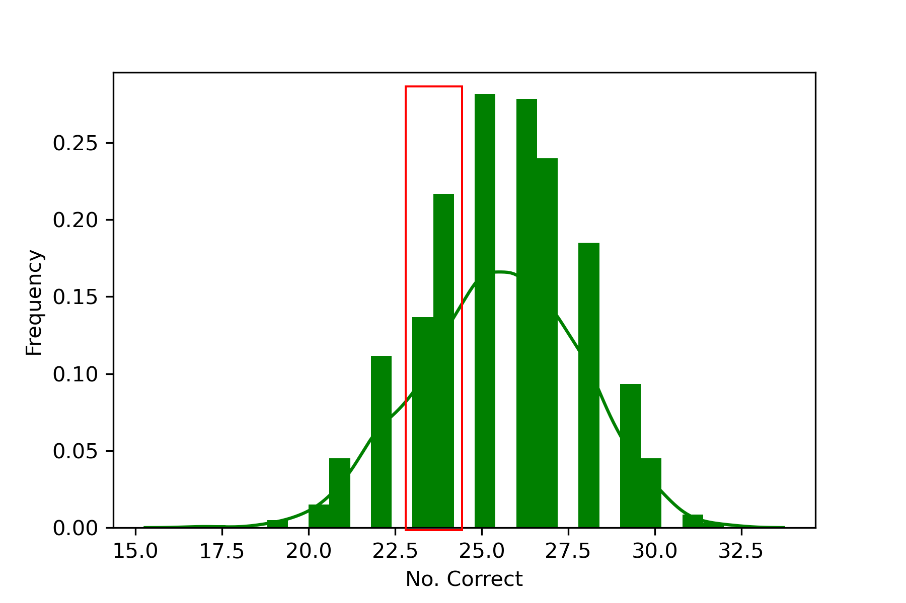

<!-- .slide: data-background="#500000" class="dark" -->

# A Modal Approach to the Space Time Dynamics of Cognitive Biomarkers 

## T. Griffith
### Defense

### April 29, 2022

---

<!-- .slide: data-background="#ffffff" class="light" -->
# ***Outline***

## 1. Introduction & Motivation
## 2. A Dynamic Systems View of Brain Waves
## 3. System Identification of Brain Wave Modes Using EEG
## 4. Modal Analysis of Brain Wave Dynamics
## 5. Adaptive Unknown Input Estimators
## 6. Reconstructing the Unknown Input Using EEG
## 7. Significant Contributions 

---

<!-- .slide: data-background="#ffffff" class="light" -->
# Modern systems demands bi-directional flow of information

 <ul style="font-size:2vw">
  <li style="padding-bottom:0.9em">Modern systems feature humans as supervisors, not sole actors</li>
  <ul>
  <li style="padding-bottom:0.9em">Teaming becomes important for safety and performance</li>
</ul> 
  <li style="padding-bottom:0.9em">Comparatively less research analyzes the information flow from human to computer.</li>
  <li style="padding-bottom:0.9em"> <em><strong> This work investigates the use of canonical engineering principles for estimation of human state/cognition.</strong></em></li>
</ul> 

<figcaption> The computer as part of the system </figcaption>

  <figcaption> The computer as a teaming member </figcaption>

---

<!-- .slide: data-background="#ffffff" class="light" -->

# Hardware and experimental design can be used to interpret information about human states from noisy physiological data.

 <ul style="font-size:2vw">
  <li style="padding-bottom:0.9em">Physiological signals are historically not portable</li>
  <ul>
  <li style="padding-bottom:0.9em">Prevented ecologically valid experiments</li>
</ul> 
  <li style="padding-bottom:0.9em">Human state (e.g. SA) reduced to discrete self reports</li>
  <li style="padding-bottom:0.9em"> <em><strong> There is new potential for modeling techniques to interpret human state from noisy physiological signals.</strong></em></li>
</ul> 

<figcaption> Time Domain fNIRS from 
<a href="https://www.kernel.com/products">Kernel Flow</a> </figcaption>

---

# Cognition as a black box

<ul style="font-size:2vw">
  <li style="padding-bottom:0.9em">Cognition gives rise to EEG signals</li>
  <ul>
  <li style="padding-bottom:0.9em">but it is ***noisy*** and only ***loosely*** correlated with cognition</li>
</ul> 
<li style="padding-bottom:0.9em">Cellular activity can only be measured invasively </li>
<li style="padding-bottom:0.9em">***Can we say something about cognition from dynamic EEG signals***? </li>
</ul> 

---

<!-- .slide: data-background="#ffffff" class="light" -->

# Nonstationary, nonlinear signals make the ***dynamics*** complicated

<ul style="font-size:2vw">
  <li style="padding-bottom:0.9em">Historically,</li>
  <ul>
  <li style="padding-bottom:0.9em">stationary analysis is used with a sliding window</li>
  <li style="padding-bottom:0.9em">or case by case highly derived models are developed</li>
</ul> 
<li style="padding-bottom:0.9em">This work seeks a method to address in engineering dynamics terms</li>
  <ul>
  <li style="padding-bottom:0.9em">with eye towards cognitive outcomes</li>
  <li style="padding-bottom:0.9em">because there are many existing analytical tools in engineering dynamics</li>
</ul> 
</ul>

<h2> a dynamic analysis in which no assumptions about stationarity are made, is required. </h2>

 <small>Hindriks, Rikkert, et al. "Latency analysis of resting-state BOLD-fMRI reveals traveling waves in visual cortex linking task-positive and task-negative networks." Neuroimage 200 (2019): 259-274.</small>

---

<!-- .slide: data-background="#ffffff" class="light" -->

# Guardrails: This is not a model of the brain!
## but you can measure EEG signals and say something about the system

 <ul style="font-size:2vw">
  <li style="padding-bottom:0.9em">Engineering mechanics does not require atomic level analysis to evaluate stress and strain.</li>
  <ul>
  <li style="padding-bottom:0.9em">Can we extend this analogy to spatio-temporal dynamics of human cognition?</li>
</ul> 
<ul>
  <li style="padding-bottom:0.9em">Because brain wave dynamics are also spectral and ***admit*** spatio-temporal modes</li>
  <li style="padding-bottom:0.9em">Without the need to model the connectome.</li>
</ul> 
</ul> 

<figure>
 

<figcaption>Surface recordings of membranes yield useful engineering information.</figcaption>
</figure>
<figure>

<figcaption>Is this notion relevant to brain waves?</figcaption>
</figure>

 <small><a href="https://wtt.pauken.org/chapter-2/membrane-modes-2/9">2D membrane modes</a> </small>

---

<!-- .slide: data-background="#003C71" class="dark" -->

# 2. A Dynamic Systems View of Brain Waves

---

<section>

<h1> A canonical approach: </h1>
 

 
:arrow_double_down:
 
Linearized brain wave "plant": 
  $\begin{aligned}
    \begin{cases}
    \dot{x}=Ax+Bu +v_x \\\
    y=Cx
    \end{cases}
  \end{aligned}$
 
<h2> linearization is ***around an operating point*** (i.e. a cognitive state) </h2>
 
but $A, \ B, \ C, \ v_x, \ x, \text{and} \ u $ are all unknown.

</section>

<section>

$A, \ B, \ C, \ v_x, \ x, \text{and} \ u $ are ***all unknown***.
  
<h2> This level of uncertainty is an unsovled problem </h2>
  

<blockquote>
Identify the plant: 
  $\begin{aligned}
    \begin{cases}
\dot{x}_m=A_m x +v_x \\\
y_m=C x_m
\end{cases}
  \end{aligned}$,
  
accepting the uncertainty in $A_m$.
</blockquote>

</section>

<section>
<h2> A modal transformation yields a discrete set of spatio-temporal modes which are useful for brain wave analysis and mapping </h2>
<figure>
  
</figure>

 <ul>
  <li style="padding-bottom:0.9em">A giant $(A,C)$ may not be useful!</li>
  <li style="padding-bottom:0.9em">Modes have:</li>
  <ul>
  <li style="padding-bottom:0.9em">Frequency ($f$)</li>
  <li style="padding-bottom:0.9em">Damping ($\zeta$)</li>
  <li style="padding-bottom:0.9em">Mode shape ($\phi$)</li>
  <li style="padding-bottom:0.9em">Complexity ($\%$)</li>
</ul> 
  <li style="padding-bottom:0.9em">Modal dynamics are equivalent to original model</li>
</ul> 

</section>

---

<!-- .slide: data-background="#003C71" class="dark" -->

# 3. System Identification of Brain Wave Modes Using EEG

---

<!-- .slide: data-background="#ffffff" class="light" -->
<section>
<h1> Datasets considered</h1>

<h2> DEAP: A Database for Emotion Analysis using Physiological Signals </h2>
<figure>
  
</figure>
 <ul>
  <li style="padding-bottom:0.9em">32 sensors</li>
  <li style="padding-bottom:0.9em">32 subjects watch 40 videos</li>
  <li style="padding-bottom:0.9em">Subjects self report Valence and Arousal</li>
</ul> 

<h2> NARC: Neuropsychoimaging of Addiction and Related Conditions Dataset </h2>
<figure>
  
</figure>
 <ul>
  <li style="padding-bottom:0.9em">60 sensors</li>
  <li style="padding-bottom:0.9em">100 subjects at rest state</li>
  <li style="padding-bottom:0.9em">Subjects self report craving scale</li>
</ul> 

 

 <small><small>Koelstra, Sander, et al. "Deap: A database for emotion analysis; using physiological signals." IEEE transactions on affective computing 3.1 (2011): 18-31.</small></small>

 <small><small>Konova, Anna B., et al. "Structural and behavioral correlates of abnormal encoding of money value in the sensorimotor striatum in cocaine addiction." European Journal of Neuroscience 36.7 (2012): 2979-2988.</small></small>

</section>

<section>
<h1> Output only modal analysis is well suited to EEG waves</h1>
 <ul>
  <li style="padding-bottom:0.9em">OMA (stochastic, zero mean)</li>
  <li style="padding-bottom:0.9em">DMD (deterministic, full state)</li>
  <li style="padding-bottom:0.9em">NeXT (deterministic, modal)</li>
  <li style="padding-bottom:0.9em">N4SID (stochastic, Kalman states)</li>
</ul> 

<figure>
  
  <figcaption>Bivariate distribution of identified modes in DEAP dataset</figcaption>
</figure>

</section>

<section>
<h1> Between 40 and 50 modes are needed for brain wave modeling </h1>

Identify the plant: 
  $\begin{aligned}
    \begin{cases}
\dot{x}_m=A_m x +v_x\\\
y_m=C x_m 
\end{cases}
  \end{aligned}$
  
$\begin{aligned}
    O&=\begin{bmatrix}
    C \\\ CA_m \\\ CA_m^2 \\\ \vdots \\\ CA_m^{s-1}
    \end{bmatrix} X_0 \\\ \\\
    &= \Gamma X_0
\end{aligned}$
  
$\begin{aligned}
    \hat{\Gamma}=US^{1/2}\\
    \hat{X}_0=S^{1/2}V^*
\end{aligned}$
  
<h3><em><strong> Observability is important! </strong></em></h3>

<figure>
  
  <figcaption>The singular values (i.e. importance) of each mode rolls off after 50 modes.</figcaption>
</figure>

</section>

<section>
<h1> Modal superposition recreates the measured data </h1>
<h2> Example from Mt. Sinai CUD database </h2>

<figure>
  
  
    <figcaption>Example mode from Mt. Sinai data: (`$f=23$` hz, `$\zeta = 0.12$`, `$C_r = 22\%$`) </figcaption>
</figure>

<figure>
  
  <figcaption> A single channel example of how modes superpose to recreate the observed EEG data. </figcaption>
</figure>

</section>

---

<!-- .slide: data-background="#003C71" class="dark" -->

# 4. Modal Analysis of Brain Wave Dynamics

---
<section>
<h1> Modal complexity and traveling waves </h1>

<figcaption> Theoretical standing wave mode shape $C_r=0\%$</figcaption>

<figcaption> Theoretical standing wave mode shape $C_r=15\%$</figcaption>

</section>

<section>
<h1> Brain wave modes can be standing or traveling </h1>

<figure>
  
  <figcaption> An example standing wave (`$C_r=5\%$`) from the Mt. Sinai database. Standing waves are most prevalent in rest conditions.</figcaption>
</figure>

<figure>
  
  <figcaption> An example traveling wave (`$C_r=83\%$`) from the Mt. Sinai database. Traveling waves are most prevalent in active conditions.</figcaption>
</figure>

</section>

<section>
<h1> Humans share certain modes</h1>

<figure>
  
  <figcaption class="description"> Alpha Mode 1 from Subject 19, ***Trial 6*** in the DEAP database. </figcaption>
</figure>

<figure>
  
  <figcaption class="description"> Alpha Mode 1 from Subject 19, ***Trial 20*** in the DEAP database. </figcaption>
</figure>

 
<blockquote>
<h4> Common mode frequencies are aligned with the Rest State Network</h4>
 <ul>
  <li style="padding-bottom:0.9em">Alpha Mode 1: `$4.34\pm 0.03$ hz`</li>
  <li style="padding-bottom:0.9em">Beta Mode 2: `$21.83 \pm 0.22$` hz</li>
  <li style="padding-bottom:0.9em">Gamma Mode 3: `$40.39\pm 0.26$` hz</li>
  <li style="padding-bottom:0.9em">Gamma Mode 4: `$44.19 \pm 0.24$` hz</li>
</ul> 
</blockquote>
</section>

<section>
<h1> These brain wave modes can be used to fingerprint or identify individual subjects </h1>

<figure>
  
  <figcaption> The subject identification confusion matrix for brain wave modes in the DEAP database. The algorithm can view a set of modes and identify the subject they came from. </figcaption>
</figure>

<table style="width:60%">
  <tr>
    <th>Reference</th>
    <th>Accuracy [%]</th>
  </tr>
  <tr>
    <td>This work</td>
    <td>99.85</td>
  </tr>
  <tr>
    <td><a href="https://ieeexplore.ieee.org/document/8745473">Wilaiprasitporn et al.</a> </td>
    <td>99.90</td>
  </tr>
  <tr>
  <tr>
    <td><a href="https://www.worldscientific.com/doi/abs/10.1142/S0129065717500356">DelPozo-Banos et al.</a> </td>
    <td>97.97</td>
  </tr>
  <tr>
</table>

</section>

<section>
<h1> Not all EEG channels are needed for subject identification </h1>

<figure>
  
  <figcaption> Subject identification accuracy vs. the number of channels in the EEG recording. </figcaption>
</figure>

<table style="width:80%">
  <tr>
    <th>Reference</th>
    <th>No. Channels</th>
    <th>Accuracy [%]</th>
  </tr>
  <tr>
    <td>This work</td>
    <td>8</td>
    <td>96.45</td>
  </tr>
  <tr>
    <td><a href="https://ieeexplore.ieee.org/document/8745473">Wilaiprasitporn et al.</a> </td>
    <td>5</td>
    <td>99.1</td>
  </tr>
  <tr>
</table>

</section>

<section>
<h1> Brain wave modes poorly match nonlinear dynamics </h1>

<figure>
  
</figure>
<figcaption> Superposed modes recreate the data they came from. </figcaption>

<figure>
  
  <figcaption> Superposed modes do not match unseen data well. An adaptive update is needed. </figcaption>
</figure>

</section>

---

<!-- .slide: data-background="#003C71" class="dark" -->

# 5. Adaptive Unknown Input Estimators

---

<section>
<h1> Adaptive Unknown Input Estimators </h1>
<h2> Estimator overview </h2>

<ul style="font-size:1.5vw">
<li style="padding-bottom:0.9em">Three significant uncertainties</li>
<ul>
  <li style="padding-bottom:0.9em"> Input $u$ is unknown, external, deterministic</li>
  <li style="padding-bottom:0.9em"> State matrix $A$ may have uncertainty</li>
  <li style="padding-bottom:0.9em"> General process uncertainty $v_x$</li>
  </ul>
<li ><strong><em>Can we synthesize $u$ and correct $A$?</em></strong></li>
</ul> 

\begin{aligned}
    \dot{x}&=Ax+Bu+v_x\\\
    y&=Cx
\end{aligned}

</section>

<section>
<h1> Adaptive Unknown Input Estimators </h1>
<h2> Modeling unknown inputs </h2>

<ul>
<li style="padding-bottom:0.9em">Approximate input space $\mathbb{U}$</li>
  <ul>
  <li style="padding-bottom:0.9em">$\hat{u}=\sum_{i=1}^{N} c_i f_i(t)$</li></ul>
<li style="padding-bottom:0.9em" style="padding-bottom:0.9em">Persistent Inputs</dt>
<ul>
  <li style="padding-bottom:0.9em">$\dot{z}_u=F_u z_u$</li>
  <li style="padding-bottom:0.9em">$\hat{u}=\Theta_u z_u$</li>
  <li style="padding-bottom:0.9em">$F_u = \begin{bmatrix} 0 & 1 & 0 \\\ -\omega^2 & 0 & 0 \\\ 0 & 0 & 0 \end{bmatrix}$</li>
  </ul>
</ul> 

<figure>
  
</figure>

</section>

<section>
<h1> Adaptive Unknown Input Estimators </h1>
<h2> Architecture and estimator error </h2>

<figure>
  
</figure>

Recover $A$ with adaptive scheme
`$$ A \equiv A_m +B L_{*} C $$`
`$$ \dot{L} = -e_y y^* \gamma_e - \alpha L; \ \alpha>0, \ \gamma_e > 0 $$`
 
Error dynamics

`$$ \dot{e}=(\bar{A}+\bar{K} \bar{C})e+\bar{B} \underbrace{\Delta L y}_\text{$w$} + v $$`
`$$ \begin{bmatrix} \dot{e}_x \\\ \dot{e}_z \end{bmatrix} = \underbrace{\begin{bmatrix} A_m+K_x C & B \Theta_u \\\ K_u C & F_u \end{bmatrix}}_\text{$\bar{A}_c$} \begin{bmatrix} e_x \\\ e_z \end{bmatrix} +\begin{bmatrix} B \\\ 0 \end{bmatrix} w +\begin{bmatrix} v_x \\\ v_u \end{bmatrix}$$`

</section>

<section>
<h1> Adaptive Unknown Input Estimators </h1>
<h2> Architecture and estimator error </h2>

<ul>
<li style="padding-bottom:0.9em">ASD plant dynamics</li>
<ul>
<li style="padding-bottom:0.9em">`$A_c^* P + P A_c = -Q$`</li>
<li style="padding-bottom:0.9em">`$PB=C^*$`</li>
</ul>
<li style="padding-bottom:0.9em">Bounded `$L_{*}$`, $v$, and $\gamma_e$</li>
<li style="padding-bottom:0.9em">Error in state and input converges to an neighborood centered at zero</li>
<ul>
<li style="padding-bottom:0.9em">`$V(e,\Delta L) = \frac{1}{2} e^* \bar{P} e + \frac{1}{2} \text{tr}(\Delta L \gamma_e^{-1} \Delta L^*)$`</li>
<li style="padding-bottom:0.9em"><strong><em>`$\lim_{t \rightarrow \infty} \sup ||e(t)|| \leq \frac{1+\sqrt{\lambda_{\text{max}}\bar{P}}}{\alpha \sqrt{\lambda_{\text{min}}\bar{P}}} M_v \equiv R^*$`</em></strong></li>
</ul>
</ul>

<figure>
  
</figure>

</section>

<section>
<h1> Illustrative example</h1>

\begin{align}
\dot{x}&=A_m x+Bu +v_x\\\
&=\begin{bmatrix}
-4 &1 &2\\\
-1 & -1 & 1\\\
-1 & 1 &-1 
\end{bmatrix}x+B u +v_x \\\
y&=Cx
\end{align}
 
<figure>
  <h4> Internal state error time series</h4>
  
</figure>

\begin{align}
\dot{x}&=A x+Bu +v_x\\\
&=\begin{bmatrix}
-2.86 &1 &4.7\\\
1.8 & -1 & 6.7\\\
-9 & 1 &-1 7.2
\end{bmatrix}x+B u +v_x\\\
y&=Cx
\end{align}
 
<figure>
  <h4> Estimating the unknown input</h4>
  
</figure>

</section>

---

<!-- .slide: data-background="#003C71" class="dark" -->

# 6. Reconstructing the Unknown Input Using EEG
Recall: Solving the nonstationary problem

---

<section>
<h1> Brain wave modes poorly match nonlinear dynamics </h1>

<figure>
  
</figure>
<figcaption> Superposed modes recreate the data they came from. </figcaption>

<figure>
  
  <figcaption> Superposed modes do not match unseen data well. An adaptive update is needed. </figcaption>
</figure>

</section>

<section>
<h1> aUIO outperforms static modes </h1>

<h3> aUIO on unseen data </h3>
<figure>
  
    <figcaption> Adaptive input estimator performance when the modes are from a different trial. </figcaption>
</figure>

<h3> Weighted modes on seen data </h3>
<figure>
  
  <figcaption> Superposition of modes decomposed from this data. </figcaption>
</figure>

</section>

<section>
<h1> aUIO critically updates model as needed </h1>

<h3> aUIO on unseen data </h3>
<figure>
  
</figure>

<h3> Adaptive gain matrix 1-norm </h3>
<figure>
  
  <figcaption> The norm measures "how much" adapting the estimator is doing</figcaption>
</figure>

</section>

<section>

<h1> Unknown Input Modeling Assumptions </h1>

 <ul style="font-size:2vw">
  <li style="padding-bottom:0.9em">Unknown input acts evenly over spatial domain</li>
  <li style="padding-bottom:0.9em">$F_u$ generates sine-cosine basis</li>
  <li style="padding-bottom:0.9em">Static gains per LQR </li>
  <li style="padding-bottom:0.9em"><strong><em>Unknown input is "external information"</em></strong></li>
</ul> 
</section>

<section>
<h1> aUIO is tolerant to some parametric uncertainty in the modes </h1>

<h3> aUIO on unseen data </h3>
<figure>
  
</figure>

<h3> aUIO with modes from another subject </h3>
<figure>
  
</figure>

</section>

<section>
<h1> Classification via estimation </h1>

<figure>
  
</figure>
 <ul>
  <li style="padding-bottom:0.9em">DEAP: Two self reported variables</li>
  <li style="padding-bottom:0.9em">$F_u$ generates sine-cosine basis</li>
  <li style="padding-bottom:0.9em">Static gains per LQR </li>
</ul> 

<figure>
  
</figure>
 <ul>
  <li style="padding-bottom:0.9em">Hypothesis:</li>
   <ul>
  <li style="padding-bottom:0.9em">modes are correlated with human state/cognition, so</li>
  <li style="padding-bottom:0.9em">same state should have similar modes, so</li>
  <li style="padding-bottom:0.9em">you can take the average modes in a state,</li>
  <li style="padding-bottom:0.9em">and the estimator will perform better than the other averaged model</li>
</ul> 
<li style="padding-bottom:0.9em"><strong><em>This is a inter-individual approach</em></strong></li>
</ul> 

</section>

<section>
<h1> This method is comparable to state of the art deep learning approaches </h1>
<ul>
  <li style="padding-bottom:0.9em">Computational input and time is lower</li>
  <li style="padding-bottom:0.9em"><strong><em>Analytical information is greater</em></strong></li>
  <li style="padding-bottom:0.9em">Accuracy is comparable</li>
</ul> 

<h3> Valence Classification </h3>
<figure>
  
</figure>

<h3> Arousal Classification </h3>
<figure>
  
</figure>

 <a href="https://dl.acm.org/doi/10.5555/3297863.3297883">CNN1</a>, <a href="https://www.sciencedirect.com/science/article/abs/pii/S0010482521005515">CNN2</a>, <a href="https://www.frontiersin.org/articles/10.3389/fnbot.2020.617531/full">MFDF</a>

</section>

---

<!-- .slide: data-background="#003C71" class="dark" -->

# 7. Significant Contributions

---
# Contributions of this dissertation

 <ul style="font-size:1.7vw">
  <li style="padding-bottom:0.9em">Output only system identification techniques are suitable for linear models of brain wave dynamics via EEG around an operating state</li>
  <li style="padding-bottom:0.9em">Real time spatio-temporal brain wave imaging via modal analysis</li>
  <li style="padding-bottom:0.9em">A novel brain wave fingerprinting algorithm on par with state of the art deep learning approaches</li>
  <li style="padding-bottom:0.9em">A complete body of adaptive, highly nonlinear unknown input estimator work</li>
  <li style="padding-bottom:0.9em">Real time brain wave imaging that accounts for nonstationary, nonlinear dynamics by updating the modes in real time</li>
  <li style="padding-bottom:0.9em">A novel recreation of the unknown brain wave plant's input</li>
  <li style="padding-bottom:0.9em">Valence-arousal emotion classification from the DEAP database on par with cutting edge deep learning approaches </li>
</ul> 

---

# Publications & Presentations

 <ul style="font-size:1.7vw">
  <li style="padding-bottom:0.9em"><strong>T. Griffith</strong>, J.E. Hubbard. System identification methods for dynamic models of brain activity. <em>Biomedical Signal Processing and Control</em> </li>
  <li style="padding-bottom:0.9em"><strong>T. Griffith</strong>, M. J. Balas. An Adaptive Control Framework for Unknown Input Estimation. <em>ASME IMECE 2021 Proceedings</em> </li>
  <li style="padding-bottom:0.9em"><strong>T. Griffith</strong>, V.P. Gehlot, M. J. Balas. Robust Adaptive Unknown Input Estimation with Uncertain System Realization. <em>AIAA SciTech 2022 Forum</em> </li>
  <li style="padding-bottom:0.9em"><strong>T. Griffith</strong>, V.P. Gehlot, M. J. Balas. Adaptive Estimation of Unknown Inputs with Weakly Nonlinear Dynamics. <em>ACC 2022</em> [Accepted] </li>
  <li style="padding-bottom:0.9em"><strong>T. Griffith</strong>, V.P. Gehlot, M. J. Balas. On the Observability of Quantum Dynamical Systems. <em>ASME IMECE 2022 Proceedings</em> [Accepted] </li>
  <li style="padding-bottom:0.9em"><strong>T. Griffith</strong>, V.P. Gehlot, M. J. Balas, J.E. Hubbard. An Adaptive Approach to Real Time EEG Estimation. <em>Biomedical Signal Processing and Control</em> [In-Review] </li>
  <li style="padding-bottom:0.9em"><strong>T. Griffith</strong>, J.E. Hubbard. System Identification of Brain Wave Modes Using EEG. <em>Journal of Neural Engineering</em> [In-Revision] </li>
</ul> 

 

---

# Future work

 <ul style="font-size:1.7vw">
  <li style="padding-bottom:0.9em">Multiple data types</li>
  <li style="padding-bottom:0.9em">Improved analysis and classification</li>
  <li style="padding-bottom:0.9em">Probablistic considerations</li>
</ul> 

---

<!-- .slide: data-background="#003C71" class="dark" -->

<h3> Every day is a new day. It is better to be lucky. </h3>
<h2> ***But I would rather be exact.*** </h2>
<h3> Then when luck comes </h3>
<h2> ***you are ready.*** </h2>
 

 <small>- The Old Man and the Sea</small>

---

<section>

  <figcaption>Theodora Chaspari </figcaption>

<figure>
  
    <figcaption>Srikanth Saripalli</figcaption>
</figure>

</section>

<section>

  <figcaption> Mark Balas </figcaption>

<figure>
  
    <figcaption>James Hubbard</figcaption>
</figure>

</section>

<section>

 <ul>
  <li> Dr. Vinod Gehlot</li>
  <li> Sarai Barnett </li>
  <li> Dr. JD</li>
  <li> Prof. Zohaib Hasnain </li>
  <li> Prof. Mike Walsh </li>
  <li>Zaryab Shahid</li>
  <li>Lise Ochej</li>
  <li>Kevin Fuentes</li>
</ul> 

</section>

<section>
<h3> Good TAMU </h3>
 <ul>
  <li> Sandra Havens </li>
  <li> Rebecca Simon </li>
  <li> Prof. Joanna Tsenn </li>
  <li> Kaustubh Mahesh Tangsali</li>
  <li> Briana Holton </li>
  <li> Khari Harrison </li>
  <li> Bryton Praslicka </li>
  <li>Robert Trépanier</li>
  <li>Harold Gamarro</li>
</ul> 

</section>

---

<!-- .slide: data-background="#500000" class="dark" -->

<h1> A Modal Approach to the Space Time Dynamics of Cognitive Biomarkers </h1>

<h3>The willow submits to the wind and prospers until one day it is many willows - a wall against the wind. </h3>

 

 <small>- Dune</small>

---

<section>
<h1> Reconstructing the Brain's Unknown Input </h1>
<h2> Classification validation </h2>

<table style="width:80%">
  <tr>
    <th>Task</th>
    <th>aUIO Acc. [%]</th>
    <th>PSD CNN Acc. [%]</th>
  </tr>
  <tr>
    <td>DEAP Valence</td>
    <td>77.8</td>
    <td>68.1</td>
  </tr>
  <tr>
    <td>DEAP Arousal</td>
    <td>75.2</td>
    <td>63.8</td>
  </tr>
  <tr>
    <td>Like/Dislike</td>
    <td>79.4</td>
    <td>67.3</td>
  </tr>
  <tr>
</table>

<h3> Static gain grid search </h3>
<figure>
  
</figure>

</section>

<section>
<h1> Output only modal analysis is well suited to the analysis of EEG waves</h1>

Identify the plant: 
  $\begin{aligned}
    \begin{cases}
\dot{x}_m=A_m x +v_x\\\
y_m=C x_m 
\end{cases}
  \end{aligned}$
  
$\begin{aligned}
    O&=\begin{bmatrix}
    C \\\ CA_m \\\ CA_m^2 \\\ \vdots \\\ CA_m^{s-1}
    \end{bmatrix} X_0 \\\
    &= \Gamma X_0
\end{aligned}$
  
$\begin{aligned}
    \hat{\Gamma}=US^{1/2}\\
    \hat{X}_0=S^{1/2}V^*
\end{aligned}$

<figure>
  
</figure>

</section>

<section>
<h1> System Identification of Brain Wave Modes Using EEG </h1>
<h2> Identifying linear patterns </h2>

Identify the plant: 
  $\begin{aligned}
    \begin{cases}
\dot{x}_m=A_m x +v_x\\\
y_m=C x_m
\end{cases}
  \end{aligned}$
  
$\begin{aligned}
    O&=\begin{bmatrix}
    C \\\ CA \\\ CA^2 \\\ \vdots \\\ CA^{s-1}
    \end{bmatrix} X_0 \\\
    &= \Gamma X_0
\end{aligned}$
  
$\begin{aligned}
    \hat{\Gamma}=U S^{1/2}\\
    \hat{X}_0=S^{1/2}V^*
\end{aligned}$

<figure>
  
</figure>

</section>

<section>
<h1> EEG characteristics </h1>

<h2> The electrical "ground" varies from laboratory to laboratory </h2>
<h4> Many different conventions, some virtual </h4>

  <figcaption> Longitudinal referencing </figcaption>

<h2> EEG signals are not independent sources of information </h2>
<h4> Sensors near each other measure overlapping activity </h4>
<figure>
  
    <figcaption>EEG channel pair plots</figcaption>
</figure>

</section>

---

<!-- .slide: data-background="#5B6236" class="dark" -->

## Backup: Best Fit B Matricies

----

<!-- .slide: data-background="#ffffff" class="light" -->

# *A* Convex Function for B matrix optimization
- $\min ||y-\hat{y}-C \Delta B \hat{u}||_2$
- ***not*** the only possible minimization

----

<!-- .slide: data-background="#ffffff" class="light" -->

# B Matrix Optimization Example
- 3x3 example
 - $\dot{\hat{x}} = A_m x + B \hat{u}$
 - $A_m \neq A$ 
- ***$\min ||y-\hat{y}-C \Delta B \hat{u}||_2$***
- $B=\begin{bmatrix} 1.2 \\\ 1 \\\ 1.6 \end{bmatrix}$, 
- $B_m=\begin{bmatrix} 1 \\\ 1 \\\ 1 \end{bmatrix}$

----

<!-- .slide: data-background="#ffffff" class="light" -->

# B Matrix Optimization Example
- $\min ||y-\hat{y}-C \Delta B \hat{u}||_2$
- $\Delta B=\begin{bmatrix} 0.18 \\\ 0 \\\ 0.37 \end{bmatrix}$, 
- $B_f=\begin{bmatrix} 1.18 \\\ 1 \\\ 1.37 \end{bmatrix}$

----

<!-- .slide: data-background="#ffffff" class="light" -->

# B Matrix on EEG Data

----

<!-- .slide: data-background="#ffffff" class="light" -->

# B Matrix on EEG Data

----

<!-- .slide: data-background="#ffffff" class="light" -->

# Current models

----

<!-- .slide: data-background="#ffffff" class="light" -->

## 5. Application to Emotion Data

----

<!-- .slide: data-background="#ffffff" class="light" -->

## B Matrix on EEG Data: ***Satisfaction (T1)*** 

----

<!-- .slide: data-background="#ffffff" class="light" -->

## B Matrix on EEG Data: ***Surprise (T2)*** 

----

<!-- .slide: data-background="#ffffff" class="light" -->

## B Matrix on EEG Data: ***Fear (T8)*** 

----

<!-- .slide: data-background="#ffffff" class="light" -->
## Comparing the same "emotion"

 <small>Mneimne, M., Powers, A. S., Walton, K. E., Kosson, D. S., Fonda, S., & Simonetti, J. (2010). Emotional valence and arousal effects on memory and hemispheric asymmetries. Brain and Cognition, 74(1), 10-17.</small>

----

<!-- .slide: data-background="#ffffff" class="light" -->

## B Matrix on EEG Data: ***HVHA*** 

----

<!-- .slide: data-background="#ffffff" class="light" -->

## B Matrix on EEG Data: ***HVLA*** 

----

<!-- .slide: data-background="#ffffff" class="light" -->

## B Matrix on EEG Data: ***LVHA*** 

----

<!-- .slide: data-background="#ffffff" class="light" -->

## B Matrix on EEG Data: ***LVLA***  

----

<!-- .slide: data-background="#ffffff" class="light" -->

## B Matrix on EEG Data: ***Avg. Quadrants***  

----

<!-- .slide: data-background="#ffffff" class="light" -->

## 6. Application to Movement Data

----

<!-- .slide: data-background="#ffffff" class="light" -->

## B Matrix on EEG Data: ***Left Hand***  

----

<!-- .slide: data-background="#ffffff" class="light" -->

## B Matrix on EEG Data: ***Right Hand***  

----

<!-- .slide: data-background="#ffffff" class="light" -->

## B Matrix on EEG Data: ***Resting***  

----

<!-- .slide: data-background="#ffffff" class="light" -->

## B Matrix on EEG Data: ***All Averages***  

----

<!-- .slide: data-background="#ffffff" class="light" -->

## A unique solution?
- B matrix is different for everyone
 - A math construct or physical significance?
- A unique input?
