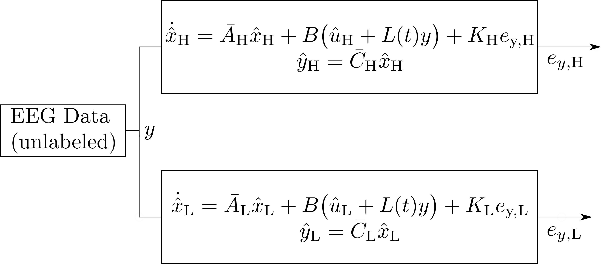
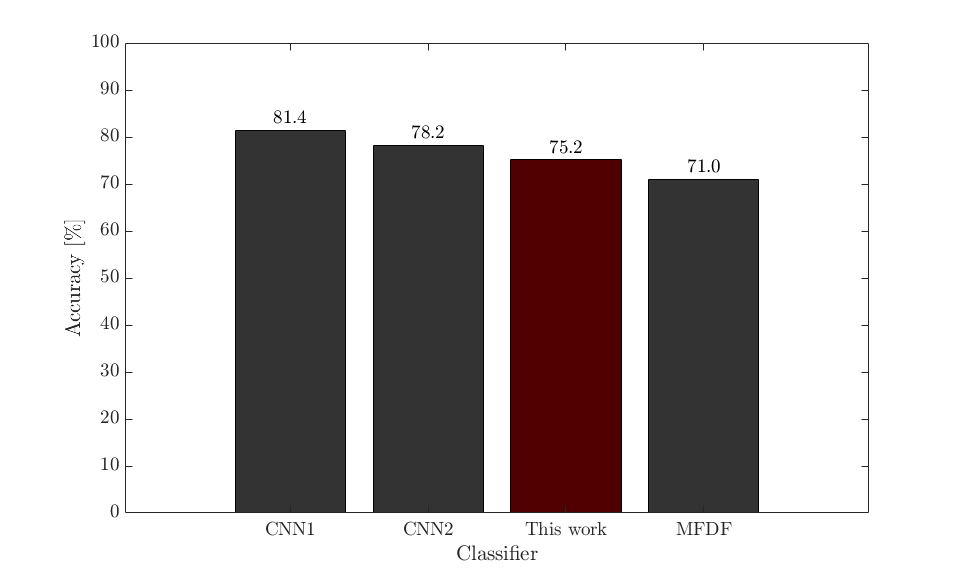

<!-- .slide: data-background="#500000" class="dark" -->

# Classifying Cognitive States via Modified Kalman Filtering

## T. Griffith
#### Quantum Seminar

#### April 15, 2022

---

<section>
<h1> Modal Analysis of Brain Wave Dynamics </h1>
<h2> Brain wave modes poorly match nonlinear dynamics </h2>

<figure>
  
</figure>

<figure>
  
</figure>

</section>

---

<!-- .slide: data-background="#003C71" class="dark" -->

# Adaptive Unknown Input Estimators

---

<section>
<h1> Adaptive Unknown Input Estimators </h1>
<h2> Estimator overview </h2>

<dl>
<dt>Three significant uncertainties</dt>
  <dd>- Input $u$ is unknown, external</dd>
  <dd>- State matrix $A$ may have uncertainty</dd>
  <dd>- General process uncertainty $v_x$</dd>
<dt>Can we synthesize $u$ and correct $A$?</dt>
</dl> 

\begin{aligned}
    \dot{x}&=Ax+Bu+v_x\\\
    y&=Cx
\end{aligned}

</section>

<section>
<h1> Adaptive Unknown Input Estimators </h1>
<h2> Modeling unknown inputs </h2>

<dl>
<dt>Approximate input space $\mathbb{U}$</dt>
  <dd>- $\hat{u}=\sum_{i=1}^{N} c_i f_i(t)$</dd>
<dt>Persisten Inputs</dt>
  <dd>- $\dot{z}_u=F_u z_u$</dd>
  <dd>- $\hat{u}=\Theta_u z_u$</dd>
  <dd>- $F_u = \begin{bmatrix} 0 & 1 & 0 \\\ -\omega^2 & 0 & 0 \\\ 0 & 0 & 0 \end{bmatrix}$</dd>
</dl> 

<figure>
  
</figure>

</section>

<section>
<h1> Adaptive Unknown Input Estimators </h1>
<h2> Architecture and estimator error </h2>

<figure>
  
</figure>

Recover $A$ with adaptive scheme
`$$ A \equiv A_m +B L_{*} C $$`
`$$ \dot{L} = -e_y y^* \gamma_e - \alpha L; \ \alpha>0, \ \gamma_e > 0 $$`
 
Error dynamics

`$$ \dot{e}=(\bar{A}+\bar{K} \bar{C})e+\bar{B}w + v $$`
`$$ \begin{bmatrix} \dot{e}_x \\\ \dot{e}_z \end{bmatrix} = \Big(\begin{bmatrix} A_m & B \Theta_u \\\ 0 & F_u \end{bmatrix} + \begin{bmatrix} K_x \\\ K_u \end{bmatrix} \begin{bmatrix} C & 0 \end{bmatrix} \Big) \begin{bmatrix} e_x \\\ e_z \end{bmatrix} +\begin{bmatrix} B \\\ 0 \end{bmatrix} w +\begin{bmatrix} v_x \\\ v_u \end{bmatrix}$$`
`$$ \begin{bmatrix} \dot{e}_x \\\ \dot{e}_z \end{bmatrix} = \underbrace{\begin{bmatrix} A_m+K_x C & B \Theta_u \\\ K_u C & F_u \end{bmatrix}}_\text{$\bar{A}_c$} \begin{bmatrix} e_x \\\ e_z \end{bmatrix} +\begin{bmatrix} B \\\ 0 \end{bmatrix} w +\begin{bmatrix} v_x \\\ v_u \end{bmatrix}$$`

</section>

<section>
<h1> Adaptive Unknown Input Estimators </h1>
<h2> Architecture and estimator error </h2>

<dl>
<dt>ASD plant dynamics</dt>
<dt>Bounded `$L_{*}$`, $v$, and $\gamma_e$</dt>
<dt>Error in state and input converges to an n-ball centered at zero</dt>
  <dd>- `$V(e,\Delta L) = \frac{1}{2} e^* \bar{P} e + \frac{1}{2} \text{tr}(\Delta L \gamma_e^{-1} \Delta L^*)$`</dd>
  <dd>- `$\lim_{t \rightarrow \infty} \sup ||e(t)|| \leq \frac{1+\sqrt{\lambda_{\text{max}}\bar{P}}}{\alpha \sqrt{\lambda_{\text{min}}\bar{P}}} M_v \equiv R^*$`</dd>
</dl> 
</section>

<section>
<h1> Illustrative example</h1>

\begin{align}
\dot{x}&=A_m x+Bu +v_x\\\
&=\begin{bmatrix}
-4 &1 &2\\\
-1 & -1 & 1\\\
-1 & 1 &-1 
\end{bmatrix}x+B u +v_x \\\
y&=Cx
\end{align}

\begin{align}
\dot{x}&=A x+Bu +v_x\\\
&=\begin{bmatrix}
-2.86 &1 &4.7\\\
1.8 & -1 & 6.7\\\
-9 & 1 &-1 7.2
\end{bmatrix}x+B u +v_x\\\
y&=Cx
\end{align}
 

 
`\begin{align}
L*=\begin{bmatrix}
-8 & 1\\\
2 & -7
\end{bmatrix}
\end{align}`

`\begin{align}
u_1(t)&=c_{11} \sin(2t)+ c_{12} \cos(2t) + c_{13} \sin(7t) + c_{14} \cos(7t)
\end{align}`
`\begin{align}
u_2(t)&=c_{11} +c_{22}t+c_{23}t^2+c_{24}t^3
\end{align}`

</section>

<section>
<h1> Illustrative example</h1>
<h3> Both the state error and the input error converge simultaneously </h3>

<h3> Internal state error as a time series </h3>
<figure>
  
</figure>

<h3> Estimating two unknown inputs </h3>
<figure>
  
</figure>

</section>

---

<!-- .slide: data-background="#003C71" class="dark" -->

# Reconstructing the Brain's Unknown Input
Recall: Solving the nonstationary problem

---

<section>
<h1> Reconstructing the Brain's Unknown Input </h1>
<h2> aUIO outperforms static modes </h2>

<h3> aUIO on unseen data </h3>
<figure>
  
</figure>

<h3> Weighted modes on seen data </h3>
<figure>
  
</figure>

</section>

<section>
<h1> Reconstructing the Brain's Unknown Input </h1>
<h2> aUIO critically updates model as needed </h2>

<h3> aUIO on unseen data </h3>
<figure>
  
</figure>

<h3> Adaptive gain matrix 2-norm </h3>
<figure>
  
</figure>

</section>

<section>
<h1> Reconstructing the Brain's Unknown Input </h1>
<h2> aUIO is tolerant to parametric uncertainty in modes </h2>

<h3> aUIO on unseen data </h3>
<figure>
  
</figure>

<h3> aUIO with wrong $A_m$ </h3>
<figure>
  
</figure>

</section>

<section>
<h1> Reconstructing the Brain's Unknown Input </h1>
<h2> Classification via estimation </h2>

<figure>
  
</figure>

<figure>
  
</figure>

</section>

<section>
<h1> Reconstructing the Brain's Unknown Input </h1>
<h2> Classification via estimation </h2>

<h3> Valence Classification </h3>
<figure>
  
</figure>

<h3> Arousal Classification </h3>
<figure>
  
</figure>

 <a href="https://dl.acm.org/doi/10.5555/3297863.3297883">CNN1</a>, <a href="https://www.sciencedirect.com/science/article/abs/pii/S0010482521005515">CNN2</a>, <a href="https://www.frontiersin.org/articles/10.3389/fnbot.2020.617531/full">MFDF</a>

</section>

<section>
<h1> Reconstructing the Brain's Unknown Input </h1>
<h2> Classification validation </h2>

<table style="width:80%">
  <tr>
    <th>Task</th>
    <th>aUIO Acc. [%]</th>
    <th>PSD CNN Acc. [%]</th>
  </tr>
  <tr>
    <td>DEAP Valence</td>
    <td>77.8</td>
    <td>68.1</td>
  </tr>
  <tr>
    <td>DEAP Arousal</td>
    <td>75.2</td>
    <td>63.8</td>
  </tr>
  <tr>
    <td>Like/Dislike</td>
    <td>79.4</td>
    <td>67.3</td>
  </tr>
  <tr>
</table>

<h3> Static gain grid search </h3>
<figure>
  
</figure>

</section>
