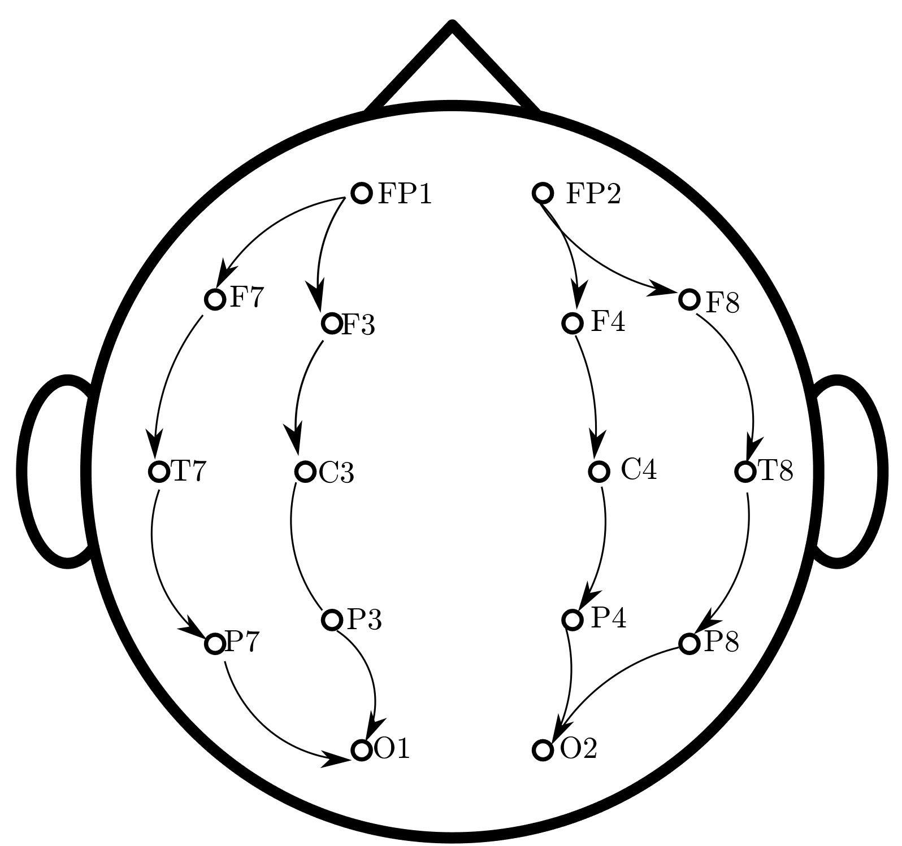

<!-- .slide: data-background="#500000" class="dark" -->

# A Modal Approach to the Space Time Dynamics of Cognitive Biomarkers 

## T. Griffith
#### Defense

#### May 20, 2021

---

<!-- .slide: data-background="#ffffff" class="light" -->
# ***Outline***

### 1. Introduction & Motivation
### 2. A Dynamic Systems View of Brain Waves
### 3. System Identification of Brain Wave Modes Using EEG
### 4. Modal Analysis of Brain Wave Dynamics
### 5. Adaptive Unknown Input Estimators
### 6. Reconstructing the Brain's Unknown Input
### 7. On the Observability of Matrix-Vector Dynamical Systems
### 8. Conclusions 

---

<!-- .slide: data-background="#ffffff" class="light" -->
# 1. Introduction & Motivation

<figcaption> Fig 1. A Wholistic View of Brain Waves </figcaption>

---

<!-- .slide: data-background="#ffffff" class="light" -->

 <a href="https://unsplash.com/@hogarthd">Hogarth de la Plante</a>, Unsplash

---

<!-- .slide: data-background="#ffffff" class="light" -->

# Clinical and HMI Applications

 <a href="https://www.wired.co.uk/article/robots-in-the-workplace">Spencer Lowell</a>, Wired, 2021

 <a href="https://www.flickr.com/photos/soldiersmediacenter/3966243098/in/photolist-73u2TG-dWQUxz-efXH4o-igJm3D-5q7oLi-6fqobG-dUigyC-5YRPEK-a92PNx-5YW2PN-6rGoZD-5SSAhx-4yRwME-5kS1mc-4LCHJ9">Army</a>, 2009

---

# Shared flow of information is implied

<figcaption> The computer as part of the system </figcaption>

  <figcaption> The computer as a teaming member </figcaption>

---

<!-- .slide: data-background="#ffffff" class="light" -->

# State of the art: surveys and orthogonal bases

> Recent modeling work, however, using large-scale dynamical models on the human connectome, suggests that cortical flow patterns are multistable and exhibit phase-transitions. To study such phenomena, a dynamic analysis in which no assumptions about stationarity are made, is required.

 <small>Hindriks, Rikkert, et al. "Latency analysis of resting-state BOLD-fMRI reveals traveling waves in visual cortex linking task-positive and task-negative networks." Neuroimage 200 (2019): 259-274.</small>

---

<!-- .slide: data-background="#ffffff" class="light" -->

# Novel potential

>  There has been a recent proliferation of more rugged and durable sensor devices (e.g., fNIRS sensors) that can be used while people take part in ecologically valid activities to assess changes in neurophysiology, physiology, and behavior that correlate with cognitive state. In addition, recent advances in machine learning and modeling techniques can be used to interpret information about human states (e.g., SA) from noisy data acquired in such environments that previously was unusable.

 <small>Bracken, B., Tobyne, S., Winder, A., Shamsi, N., & Endsley, M. R. (2021, July). Can Situation Awareness Be Measured Physiologically?. In International Conference on Applied Human Factors and Ergonomics (pp. 31-38). Springer, Cham.</small>

---

<!-- .slide: data-background="#ffffff" class="light" -->

## There is a demonstrated need for improved models of neural biomarkers that consider ***nonstationary spatio-temporal dynamics*** jointly.

- Rigorous
- Transparent
- Non-invasive
- Physiological

---

<!-- .slide: data-background="#ffffff" class="light" -->

# Modeling considerations
- Local vs. ***Whole***
- Linear vs. ***Nonlinear***
- ***Individual*** vs. Population
- Static vs. ***Dynamic***
- Offline vs. ***Online***
- Parametric vs. ***Nonparametric***

---

<!-- .slide: data-background="#ffffff" class="light" -->

# 2. A Dynamic Systems View of Brain Waves

---

<!-- .slide: data-background="#ffffff" class="light" -->

# Characteristics of EEG

 <ul>
  <li>EEG is only loosely tied to outcomes</li>
  <li>Linear, nonlinear, and noise</li>
  <li>Channel cross talk</li>
  <li>Variety of referencing techniques</li>
</ul> 

  <figcaption> Longitudinal referencing </figcaption>

<figure>
  
    <figcaption>EEG channel pair plots</figcaption>
</figure>

---

<!-- .slide: data-background="#ffffff" class="light" -->

# A cannonical approach: 

:arrow_double_down:

True brain wave plant: 
  $\begin{aligned}
    \begin{cases}
    \dot{x}=Ax+Bu +v_x \\\
    y=Cx
    \end{cases}
  \end{aligned}$

where $A, \ B, \ C, \ v_x, \ x, \text{and} \ u $ are ***all unknown***.

----

## This level of uncertainty is an unsovled problem 

Identify the plant: 
  $\begin{aligned}
    \begin{cases}
\dot{x}_m=A_m x \\\
y_m=C x_m
\end{cases}
  \end{aligned}$,

accepting the uncertainty in $A_m$.

----

## Treating nonlinear effects

<figure>
  
</figure>
<figure>
  
</figure>
<figure>
  
</figure>

<h3> Adaptive Unknown Input Brain Wave Estimator: </h3>

  $\begin{aligned}
    \begin{cases} 
      \dot{\hat{x}}=\big(A_m+BL(t)C\big) \hat{x} + B\hat{u} + K_x e_y; \\\
      \hat{y}= C \hat{x}.
    \end{cases} 
  \end{aligned}$

----
## Modes elegantly capture the spatio-temporal dynamics

<h4> True brain wave plant </h4>
  $\begin{aligned}
    \begin{cases}
    \dot{x}=Ax+Bu +v_x \\\
    y=C x
    \end{cases}
  \end{aligned}$
 
:arrow_double_down:
<h4> Modal brain wave plant </h4>
  $\begin{aligned}
    \begin{cases}
    \dot{\eta}=\Lambda \eta +V^{-1}B u + V^{-1} v_x \\\
    y=CV \eta
    \end{cases}
  \end{aligned}$

<h3> Some important analytical properties: </h3>

 <ul>
  <li>Frequency</li>
  <li>Damping</li>
  <li>Mode shape</li>
  <li>Complexity</li>
</ul> 

---

<!-- .slide: data-background="#ffffff" class="light" -->

# 3. System Identification of Brain Wave Modes Using EEG

---

