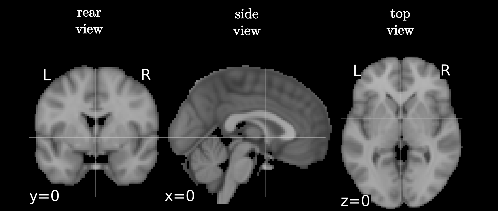

<!-- .slide: data-background="#500000" class="dark" -->

# A Modal Approach to the Space Time Dynamics of Cognitive Biomarkers 

## T. Griffith
#### Defense briefing

#### March 17, 2022

---

<!-- .slide: data-background="#ffffff" class="light" -->
# ***Outline***

### 1. Introduction & Motivation
### 2. A Dynamic Systems View of Brain Waves
### 3. System Identification of Brain Wave Modes Using EEG
### 4. Modal Analysis of Brain Wave Dynamics
### 5. Adaptive Unknown Input Estimators
### 6. Reconstructing the Brain Wave Unknown Input
### 7. On the Observability of Matrix-Vector Dynamical Systems
### 8. Conclusions 

---

<!-- .slide: data-background="#ffffff" class="light" -->
# Introduction & Motivation

<figcaption> Fig 1. A Wholistic View of Brain Waves </figcaption>

> Recent modeling work, however, using large-scale dynamical models on the human connectome, suggests that cortical flow patterns are multistable and exhibit phase-transitions. To study such phenomena, a dynamic analysis in which no assumptions about stationarity are made, is required.

 <small>Hindriks, Rikkert, et al. "Latency analysis of resting-state BOLD-fMRI reveals traveling waves in visual cortex linking task-positive and task-negative networks." Neuroimage 200 (2019): 259-274.</small>

---

<!-- .slide: data-background="#ffffff" class="light" -->

<section>

<h1> A cannonical approach: </h1>

<h4> True brain wave plant </h4>
  $\begin{aligned}
    \begin{cases}
    \dot{x}=A x+Bu +v_x \\\
    y=Cx
    \end{cases}
  \end{aligned}$
 
:arrow_double_down:
<h4> Modal brain wave plant </h4>
  $\begin{aligned}
    \begin{cases}
    \dot{\eta}=\Lambda \eta +V^{-1}B u + V^{-1} v_x \\\
    y=CV \eta
    \end{cases}
  \end{aligned}$
  
where $A, \ B, \ C, \ v_x, \ x, \text{and} \ u $ are ***all unknown***.

<h3> This level of uncertainty is an unsovled problem </h3>

Identify the plant: 
  $\begin{aligned}
    \begin{cases}
\dot{x}_m=A_m x \\\
y_m=C x_m
\end{cases}
  \end{aligned}$,
 
:arrow_double_down:
<h3> Adaptive Unknown Input Brain Wave Estimator: </h3>

  $\begin{aligned}
    \begin{cases} 
      \dot{\hat{x}}=\big(A_m+BL(t)C\big) \hat{x} + B\hat{u} + K_x e_y; \\\
      \hat{y}= C \hat{x}.
    \end{cases} 
  \end{aligned}$

</section>

---

<!-- .slide: data-background="#ffffff" class="light" -->
<section>

<h1> System Identification of Brain Wave Modes Using EEG </h1>
<h2> Identifying linear patterns </h2>

Identify the plant: 
  $\begin{aligned}
    \begin{cases}
\dot{x}_m=A_m x \\\
y_m=C x_m
\end{cases}
  \end{aligned}$
  
$\begin{aligned}
    O&=\begin{bmatrix}
    C \\\ CA \\\ CA^2 \\\ \vdots \\\ CA^{s-1}
    \end{bmatrix} X_0 \\\
    &= \Gamma X_0
\end{aligned}$
  
$\begin{aligned}
    \hat{\Gamma}=US^{1/2}\\
    \hat{X}_0=S^{1/2}V^*
\end{aligned}$

<figure>
  
</figure>

</section>

<section>

<h1> System Identification of Brain Wave Modes Using EEG </h1>
<h2> Identifying linear patterns </h2>

Identify the plant: 
  $\begin{aligned}
    \begin{cases}
\dot{x}_m=A_m x \\\
y_m=C x_m
\end{cases}
  \end{aligned}$
  
$\begin{aligned}
    O&=\begin{bmatrix}
    C \\\ CA \\\ CA^2 \\\ \vdots \\\ CA^{s-1}
    \end{bmatrix} X_0 \\\
    &= \Gamma X_0
\end{aligned}$
  
$\begin{aligned}
    \hat{\Gamma}=U S^{1/2}\\
    \hat{X}_0=S^{1/2}V^*
\end{aligned}$

<figure>
  
  
</figure>

</section>

---

<section>

<h1> Analysis of Linear Brain Wave Modes </h1>

<figure>
  
  
</figure>

<figure>
  
</figure>

</section>

---

<section>

<h1> Unknown Input Estimators </h1>

<figure>
  
</figure>

<figure>
  
</figure>

</section>

---

<section>

<h1> aUIO Performance </h1>

<figure>
  
</figure>

<figure>
  
</figure>

</section>

---

<section>

<h1> Classification </h1>

<figure>
  
</figure>

<figure>
  
</figure>

</section>

---

<section>

<h1> Quantum Observability </h1>

$\begin{aligned}
  \dot{\rho}(t)&=\sum_{k=1}^{N} p_k \dot{P}_k(t) \\\
  &= -i [H\rho(t)-\rho(t) H] \\\
  &=(-i)[H,\rho]\equiv (-i) L\rho \\\
  y_i(t)&=\text{tr}(C_i \rho)
\end{aligned}$
  
`$$ y^{(k)}(0)=(C,A^k \rho_0)_{\text{tr}} = (\underbrace{(A^*)^k C}_{\Theta_k}, \rho_0)_{\text{tr}}; \ k=0,1,\ldots,N^2-1 $$`

<figure>
  
  
</figure>

</section>